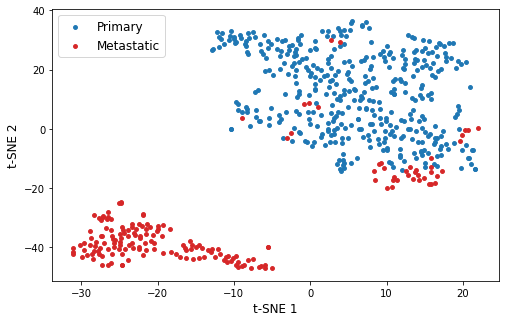

# ecbme-4060-final-project
## Final Project for ECBME 4060: Prostate Cancer Classification

Team: Neil Kennedy (nmk2142), Shouvik Mani (sm5119), James Slater (jls2357)

In this project, we train a machine learning model to predict whether a patient has primary or metastatic prostate cancer on the basis of their genomic profile (RNA sequencing). We compare this model against [P-NET](https://github.com/marakeby/pnet_prostate_paper), a biologically-informed deep neural network for prostate cancer classification and discovery (Elmarakeby et al.).

This repository contains the following relevant files:
- `prostate_cancer_classification.ipynb` trains a prostate cancer state (primary/metastatic) classifier using gene expression data.
- `pnet_model_prostate.ipynb` reproduces results from the P-NET paper, classifying prostate cancer state (primary/metastatic) using mutation and copy-number alteration data.
- `data/` contains the gene expression matrix and cancer state labels for use in prostate_cancer_classification.ipynb. The data is a subset of the [P-NET dataset](https://drive.google.com/uc?id=17nssbdUylkyQY1ebtxsIw5UzTAd0zxWb&export=download).
- `pnet_prostate_paper` a copy of the [P-NET repository](https://github.com/marakeby/pnet_prostate_paper)
